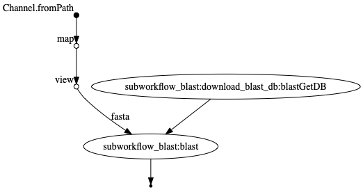

# NEMO
A NExtflow MOdule helper. This is a repository for Nextflow modules and helper scripts.


# Installation

You simply need 

* Docker
* Nextflow

installed to execute tools within this workflow. Please cite Nextflow and the tools you are using. 

# Input examples

* **one** .fastq file per sample: `--nano 'sample1.fastq'`
* paired end illumina: `--illumina 'S_41_17_Cf*.R{1,2}.fastq.gz'`

# Execution example

````
nextflow run main.nf --help
````

# Flowchart
